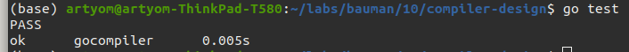
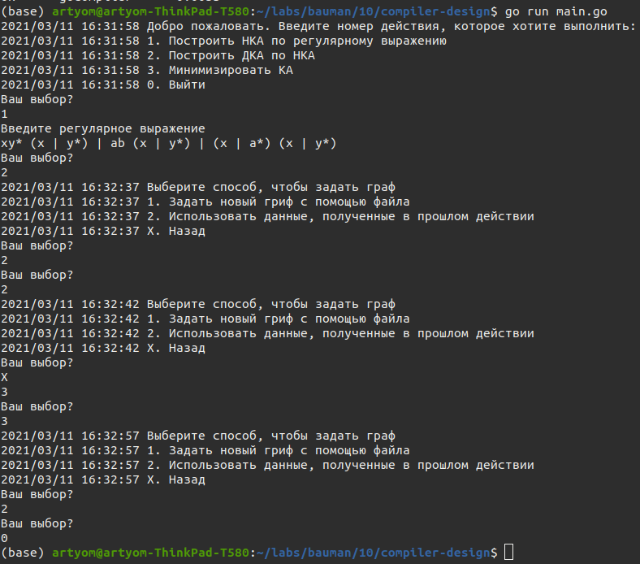

## **Распознавание цепочек регулярного языка**

*Выполнено* ***Доктором А. А.*** _ИУ7-22м_

В рамках лабораторной работы №1 по курсу _Конструирование компиляторов_

## 1. Цель и задачи работы

**Цель работы**: приобретение практических навыков реализации важнейших элементов лексических анализаторов на примере распознавания цепочек регулярного языка.

**Задачи работы**:

1) Ознакомиться с основными понятиями и определениями, лежащими в основе построения лексических анализаторов.
2) Прояснить связь между регулярным множеством, регулярным выражением, праволинейным языком, конечно- автоматным языком и недетерминированным конечно-автоматным языком.
3) Разработать, тестировать и отладить программу распознавания цепочек регулярного или праволинейного языка в соответствии с предложенным вариантом грамматики.

## 2. Вариант задания

Напишите программу, которая в качестве входа принимает произвольное регулярное выражение, и выполняет

следующие преобразования:

1) По регулярному выражению строит НКА.
2) По НКА строит эквивалентный ему ДКА.
3) По ДКА строит эквивалентный ему КА, имеющий наименьшее возможное количество состояний. Указание. Воспользоваться алгоритмом, приведенным по адресу http://neerc.ifmo.ru/wiki/index.php?title=Алгоритм_Бржозовского
4) Моделирует минимальный КА для входной цепочки из терминалов исходной грамматики.

## 3. Реализация

### Структуры данных

1. [Граф](https://github.com/SmartPhoneJava/compiler-design/blob/56032407c7aa534d473c42d233e4548204a47100/1/internal/graph/graph.go#L29-L38) представлен наборами вершин и узлов, а так же множеством начальных и конечных узлов:

```go
type Graph struct {
	Vertexes map[string]*Vertex
	Edges    map[string]*Edge

	// Истоки и стоки
	First, Last []string
}
```

2. [Вершина](https://github.com/SmartPhoneJava/compiler-design/blob/56032407c7aa534d473c42d233e4548204a47100/1/internal/graph/graph.go#L9-L13) представляет собой связку из идентификатора и хэш-таблиц с входными и выходными дугами:

```go
type Vertex struct {
	ID  string
	Out map[string]*Edge
	In  map[string]*Edge
}
```

3. [Дуга](https://github.com/SmartPhoneJava/compiler-design/blob/56032407c7aa534d473c42d233e4548204a47100/1/internal/graph/graph.go#L16-L20) - переход из состояния `from` в `to` по символу `weight`:

```go
type Edge struct {
	From   string
	To     string
	Weight string
}
```

### Построение НКА по регулярному выражению

На вход поступает строка(`input`), на выходе конечный автомат, представленный графом. В начале граф содержит две вершины и соединяющую их дугу с весом `input`. Дальше происходит "разрастание" графа по `алгоритму Мак-Нотона-Ямады-Томпсона`[3]

Пока есть изменения (`changes > 0`) для каждой дуги графа, где длина строки веса превышает размер символа (`len(weight) > 1`) выполнить:

1. Найти и устранить замыкание `*`:
   1. Удалить обрамляющие скобки, если есть
   2. Если обнаружен символ `*`, убираем его и отмечаем это
2. Найти объединения в `weight`. Если удалось найти `k` объединенй, где `k>1`, то удаляем текущую дугу между вершинами `qN`и`qM` и создаем `k` параллельных дуг от `qN`и`qM`до`qM`с весами - подстроками полученных из`weight`
3. Найти конкатенации в `weight`. Если удалось найти `k` конкатенаций, где `k>1`, то удаляем текущую дугу между вершинами `qN`и`qM` и создаем последовательно `k` дуг с весами - подстроками полученных из `weight`

Исходный код функции `Unions`, отвечающей за разбиение на множество объединений:

```go
func (str *RW) Unions() RWS {
	var lexemes = make(RWS, 0)
	var (
		bracketOn, begin int
	)
	for i, r := range *str {
		switch r {
		case '(':
			bracketOn++
		case ')':
			bracketOn--
		case '|':
			if bracketOn == 0 {
				lexemes = append(lexemes, (*str)[begin:i])
				begin = i + 1
			}
		}
	}
	if begin > 0 && begin < len(*str) {
		lexemes = append(lexemes, (*str)[begin:])
	}
	return lexemes
}
```

Исходный код функции `Concatenations`, отвечающей за разбиение на множество конкатенаций:

```go
func (str RW) Concatenations() []RW {
	var lexemes = make([]RW, 0)
	var (
		bracketOn, begin int
	)
	for i, r := range str {
		switch r {
		case ' ':
			continue
		case '(':
			if bracketOn == 0 {
				begin = i + 1
			}
			bracketOn++
		case ')':
			bracketOn--
			if bracketOn == 0 {
				lexemes = append(lexemes, str[begin:i])
				begin = i + 1
			}
		case '|':
			if bracketOn == 0 {
				return nil
			}
		default:
			if bracketOn == 0 {
				lexemes = append(lexemes, RW(r))
			}
		}
	}
	return lexemes
}
```

Исходный код функции `MultiplyEdge`, распараллеливающей дуги:

```go
func (g *Graph) MultiplyEdge(e *Edge, newWeights ...string) {
	if len(newWeights) < 2 {
		return
	}
	for _, weight := range newWeights {
		g.AddEdge(&Edge{
			From:   e.From,
			To:     e.To,
			Weight: weight,
		})
	}
	g.RemoveEdge(e)
}
```

Исходный код функции `SplitEdge`, добавляющую последовательность дуг:

```go
func (g *Graph) SplitEdge(e *Edge, newWeights ...string) {
	if len(newWeights) == 0 {
		return
	}
	var prevEdge = Edge{
		To: e.From,
	}
	for i, weight := range newWeights {
		var newEdge = &Edge{
			From:   prevEdge.To,
			Weight: weight,
		}
		if i == len(newWeights)-1 {
			newEdge.To = e.To
		}
		prevEdge = g.AddEdge(newEdge)
	}
	g.RemoveEdge(e)
}
```

Получившийся КА содержит замыкания и  эквивалентные дуги, поэтому от них необходимо избавиться. Для этих целей служат функции `RemoveShortCircuits`, `ReplaceEpsilons`, `ReplaceEqualEdges`. Их исходный код приведен ниже.

```go
// RemoveShortCircuits убрать замыкания
func (fsm *FSM) RemoveShortCircuits() *FSM {
	for _, e := range fsm.Edges {
		if e.Weight == "*" {
			vIn := fsm.Vertexes[e.From].In
			for _, ei := range vIn {
				var newEdge = graph.Edge{
					From:   ei.From,
					To:     ei.To,
					Weight: "e",
				}
				fsm.RemoveEdge(ei)
				fsm.AddEdge(&newEdge)
				fsm.AddEdge(&graph.Edge{
					From:   ei.To,
					To:     ei.To,
					Weight: ei.Weight,
				})
				break
			}
			e.Weight = "e"
		}
	}
	for _, v := range fsm.Vertexes {
		if len(v.In)+len(v.Out) == 0 {
			fsm.RemoveVertex(v.ID)
		}
	}
	return fsm
}

// ReplaceEpsilons заменить епсилон-переходы
func (fsm *FSM) ReplaceEpsilons() *FSM {
	//log.Println("Заменить епсилон-переходы")
	var newFSM = &FSM{graph.NewGraph()}
	for _, v := range fsm.Vertexes {
		m := fsm.replaceEpsilons(v, "e", false)

		for k, val := range m {
			if k == v.ID {
				continue
			}
			newFSM.AddEdge(&graph.Edge{
				From:   v.ID,
				To:     k,
				Weight: val,
			})
		}

		// Добавляем в новый граф завихренные ребра(на самого себя)
		for _, edge := range v.Out {
			if edge.From == edge.To {
				newFSM.AddEdge(&graph.Edge{
					From:   edge.From,
					To:     edge.To,
					Weight: edge.Weight,
				})
			}
		}
	}

	*fsm = *newFSM
	return fsm
}

// ReplaceEqualEdges - убрать ребра-дубли
func (fsm *FSM) ReplaceEqualEdges() *FSM {
	//log.Println("Убрать ребра дубли")
	var (
		removeVertexes = make([]*graph.Vertex, 0)
		vertexCount    = len(fsm.Vertexes)
		vertexes       = fsm.VertexesArr()
	)
	for i := 0; i < vertexCount; i++ {
		for j := i + 1; j < vertexCount; j++ {
			var (
				v1 = vertexes[i]
				v2 = vertexes[j]
			)
			if len(v1.Out) != len(v2.Out) {
				continue
			}
			var m = make(map[string]bool, 0)

			for _, edge := range v1.Out {
				m[edge.To] = true
			}
			for _, edge := range v2.Out {
				delete(m, edge.To)
			}
			// Полное совпадение исходящих дуг!
			if len(m) == 0 {
				// Добавляем к одной из вершин входящие дуги второй

				var m = make(map[string]*graph.Edge, 0)

				for _, edge := range v1.In {
					m[edge.From] = edge
				}
				for _, edge := range v2.In {
					delete(m, edge.From)
				}
				for k, v := range m {
					fsm.AddEdge(&graph.Edge{
						From:   k,
						To:     v2.ID,
						Weight: v.Weight,
					})
				}

				//  Первая вершина нам больше не нужна, но мы
				// не можем ее сразу удалить поскольку итерируемся
				// по списку вершин, поэтому удалим ее попозже
				removeVertexes = append(removeVertexes, v1)
			}
		}
	}

	for _, v := range removeVertexes {
		fsm.RemoveVertex(v.ID)
	}
	return fsm
}

```

И последней деталью, необходимой для того, чтобы граф считался КА, является наличие входных и конечных состояний. Они вычисляются функцией `AutoDetectFirstLast`

```go
func (fsm *FSM) AutoDetectFirstLast() {
	for _, v := range fsm.Vertexes {
		if len(v.Out) == 0 {
			fsm.Last = append(fsm.Last, v.ID)
		}
		if len(v.In) == 0 {
			fsm.First = append(fsm.First, v.ID)
		}
	}
}
```

### Строительство эквивалентного ДКА по НКА

В основе алгоритма составления ДКА лежит алгоритм Томпсона.

Алгоритм Томпсона строит по [НКА](https://neerc.ifmo.ru/wiki/index.php?title=%D0%9D%D0%B5%D0%B4%D0%B5%D1%82%D0%B5%D1%80%D0%BC%D0%B8%D0%BD%D0%B8%D1%80%D0%BE%D0%B2%D0%B0%D0%BD%D0%BD%D1%8B%D0%B5_%D0%BA%D0%BE%D0%BD%D0%B5%D1%87%D0%BD%D1%8B%D0%B5_%D0%B0%D0%B2%D1%82%D0%BE%D0%BC%D0%B0%D1%82%D1%8B "Недетерминированные конечные автоматы") эквивалентный [ДКА](https://neerc.ifmo.ru/wiki/index.php?title=%D0%94%D0%B5%D1%82%D0%B5%D1%80%D0%BC%D0%B8%D0%BD%D0%B8%D1%80%D0%BE%D0%B2%D0%B0%D0%BD%D0%BD%D1%8B%D0%B5_%D0%BA%D0%BE%D0%BD%D0%B5%D1%87%D0%BD%D1%8B%D0%B5_%D0%B0%D0%B2%D1%82%D0%BE%D0%BC%D0%B0%D1%82%D1%8B "Детерминированные конечные автоматы") следующим образом:

* Помещаем в очередь Q множество, состоящее только из стартовой вершины.
* Затем, пока очередь не пуста выполняем следующие действия:
  * Достаем из очереди множество, назовем его q
  * Для всех c∈Σ посмотрим в какое состояние ведет переход по символу cc из каждого состояния в q. Полученное множество состояний положим в очередь Q только если оно не лежало там раньше. Каждое такое множество в итоговом ДКА будет отдельной вершиной, в которую будут вести переходы по соответствующим символам.
  * Если в множестве qq хотя бы одна из вершин была терминальной в НКА, то соответствующая данному множеству вершина в ДКА также будет терминальной.

Реализация представлена в листинге ниже, функция `ToDka`

```go
func (fsm *FSM) ToDka() *FSM {
	//log.Println("Построить ДКА, эквивалентное указанному НКА")
	if len(fsm.Vertexes) == 0 {
		return fsm
	}
	var (
		visitedCombinations = make(map[string]bool, 0)
		newFSM              = &FSM{graph.NewGraph()}
		queue               = []DKAVertex{
			{
				Olds: fsm.First,
				From: fsm.First[0],
			},
		}
		lastVertexes []string
	)
	for len(queue) != 0 {
		head := queue[0]

		// ключ - путь, значения - в каких узлы ведет
		// вложенная мэпа, чтобы гарантировать уникальность узлов
		var paths = make(map[string]map[string]bool, 0)
		for _, old := range head.Olds {
			toWhom := fsm.Vertexes[old].Out
			for _, e := range toWhom {
				_, ok := paths[e.Weight]
				if !ok {
					paths[e.Weight] = make(map[string]bool, 0)
				}
				paths[e.Weight][e.To] = true
			}
		}
		for path, vertexes := range paths {
			var (
				ids      = make([]string, 0)
				withLast bool
			)
			for vertex := range vertexes {
				ids = append(ids, vertex)
				if !withLast {
					withLast = fsm.FindInString(vertex, fsm.Last)
				}
			}
			var id string
			sort.Strings(ids)
			id = strings.Join(ids, " ")

			newVertex := newFSM.AddVertex(graph.VertexOptID(id))
			newFSM.AddEdge(&graph.Edge{
				From:   head.From,
				To:     newVertex,
				Weight: path,
			})
			if withLast {
				lastVertexes = append(lastVertexes, newVertex)
			}

			_, ok := visitedCombinations[id]
			if ok {
				continue
			}

			visitedCombinations[id] = true

			queue = append(queue, DKAVertex{
				Olds: ids,
				From: newVertex,
			})
		}

		queue = queue[1:]
	}
	newFSM.SetFirstLast(fsm.First, lastVertexes)
	//newFSM.ReplaceEqualEdges()
	*fsm = *newFSM
	return fsm
}
```

### Минимизация с помошью алгоритма Бржозовского

Введём следующие обозначения:

* `A`— конечный автомат,
* `d(A)` — детерминизированный автомат для `A`,
* `r(A)` — обратный автомат для AA,
* `dr(A)` — результат `d(r(A))`. Аналогично для `rdr(A)` и `drdr(A)`.

Пусть `A` — автомат (необязательно детерминированный), распознающий язык `L`. Минимальный   детерминированный автомат `A` может быть вычислен следующим образом: `A=drdr(A)`

Для детерминизации служит функция `D`, вызывающая  `ToDka`, описанную пунктом выше. А обратный автомат строит функцию `R`:

```go
// D Детерминизировать КА
func (A *DR) D() *DR {
	v := &DR{FSM{A.ToDka().Beautify()}}
	*A = *v
	return A
}

// R Построить обратный КА
func (A *DR) R() *DR {
	var reverseMe = NewDR()
	for _, edge := range A.Edges {
		reverseMe.AddEdge(&graph.Edge{
			From:   edge.To,
			To:     edge.From,
			Weight: edge.Weight,
		})
	}

	reverseMe.SetFirstLast(A.Last, A.First)
	reverseMe = &DR{FSM{reverseMe.Beautify()}}
	*A = *reverseMe
	return A
}
```

С учетом этих функций алгоритм минимизации выглядит следующим образом: `A.R().D().R().D()`, где `A` - КА

## 4. Набор тестов

Для тестирования был написан ряд тестов:

```go
// Пример из https://habr.com/ru/post/166777/
func TestExpression1(t *testing.T) {
	var (
		rw     = expressions.NewRW("(xy* | ab | (x | a*)) (x | y*)")
		kda    = converter.ExpressionToNKA(&rw)
		folder = "assets/test/expressions/2"
	)

	visualizer.MustVisualizeFSM(kda, folder, "v1.dot")

	kda.RemoveShortCircuits()
	visualizer.MustVisualizeFSM(kda, folder, "v2.dot")

	kda.ReplaceEpsilons()
	visualizer.MustVisualizeFSM(kda, folder, "v3.dot")

	kda.ReplaceEqualEdges()
	visualizer.MustVisualizeFSM(kda, folder, "v4.dot")

	kda.AutoDetectFirstLast()

	kda.ToDka()
	visualizer.MustVisualizeFSM(kda, folder, "v5.dot")

	kda.ReplaceEqualEdges()
	visualizer.MustVisualizeFSM(kda, folder, "v6.dot")

	var expected = fsm.NewDRFromEdges([]graph.Edge{
		{
			From:   "p0",
			To:     "p1",
			Weight: "x",
		},
		{
			From:   "p1",
			To:     "p1",
			Weight: "y",
		},
		{
			From:   "p1",
			To:     "p4",
			Weight: "x",
		},
		{
			From:   "p0",
			To:     "p2",
			Weight: "y",
		},
		{
			From:   "p2",
			To:     "p2",
			Weight: "y",
		},
		{
			From:   "p0",
			To:     "p3",
			Weight: "a",
		},
		{
			From:   "p3",
			To:     "p2",
			Weight: "y",
		},
		{
			From:   "p3",
			To:     "p5",
			Weight: "a",
		},
		{
			From:   "p3",
			To:     "p6",
			Weight: "b",
		},
		{
			From:   "p5",
			To:     "p5",
			Weight: "a",
		},
		{
			From:   "p5",
			To:     "p2",
			Weight: "y",
		},
		{
			From:   "p5",
			To:     "p4",
			Weight: "x",
		},
		{
			From:   "p6",
			To:     "p2",
			Weight: "y",
		},
		{
			From:   "p6",
			To:     "p4",
			Weight: "x",
		},
		{
			From:   "p3",
			To:     "p4",
			Weight: "x",
		},
	}, []string{"p0"}, []string{"p4"})

	origin := fsm.NewDRFromFS(*kda)

	visualizer.MustVisualizeDR(origin.CompareMode(), folder, "real.dot")
	visualizer.MustVisualizeDR(expected.CompareMode(), folder, "expected.dot")

	if !expected.IsSame(*origin) {
		t.Fatalf("Графы не сошлись, см. картинки в /assets/test")
	}
}
```

```go
// Пример из http://neerc.ifmo.ru/wiki/index.php?title=Алгоритм_Бржозовского
func TestMinimize1(t *testing.T) {
	var origin = fsm.NewDRFromEdges([]graph.Edge{
		{
			From:   "0",
			To:     "1",
			Weight: "a",
		},
		{
			From:   "0",
			To:     "2",
			Weight: "a",
		},
		{
			From:   "0",
			To:     "2",
			Weight: "b",
		},
		{
			From:   "1",
			To:     "2",
			Weight: "a",
		},
		{
			From:   "2",
			To:     "1",
			Weight: "a",
		},
		{
			From:   "2",
			To:     "2",
			Weight: "a",
		},
		{
			From:   "2",
			To:     "3",
			Weight: "b",
		},
		{
			From:   "1",
			To:     "3",
			Weight: "b",
		},
	}, []string{"0"}, []string{"3"})
	visualizer.MustVisualizeFSM(&origin.FSM, "assets/test/min/1", "origin.dot")
	var expected = fsm.NewDRFromEdges([]graph.Edge{
		{
			From:   "0",
			To:     "1",
			Weight: "a",
		},
		{
			From:   "0",
			To:     "1",
			Weight: "b",
		},
		{
			From:   "1",
			To:     "1",
			Weight: "a",
		},
		{
			From:   "1",
			To:     "2",
			Weight: "b",
		},
	}, []string{"0"}, []string{"2"})
	origin.R().D().R().D()

	visualizer.MustVisualizeFSM(&origin.FSM, "assets/test/min/1", "real.dot")

	if !expected.IsSame(*origin) {
		visualizer.MustVisualizeFSM(&expected.FSM, "assets/test/min/1", "expected.dot")
		t.Fatalf("Графы не сошлись, см. картинки в /assets/test")
	}
}

// Пример из http://neerc.ifmo.ru/wiki/index.php?title=Минимизация_ДКА,_алгоритм_за_O(n%5E2)_с_построением_пар_различимых_состояний
func TestMinimize2(t *testing.T) {
	var origin = fsm.NewDRFromEdges([]graph.Edge{
		{
			From:   "A",
			To:     "B",
			Weight: "1",
		},
		{
			From:   "B",
			To:     "A",
			Weight: "1",
		},
		{
			From:   "B",
			To:     "H",
			Weight: "0",
		},
		{
			From:   "A",
			To:     "H",
			Weight: "0",
		},
		{
			From:   "H",
			To:     "C",
			Weight: "0",
		},
		{
			From:   "H",
			To:     "C",
			Weight: "1",
		},
		{
			From:   "C",
			To:     "E",
			Weight: "0",
		},
		{
			From:   "C",
			To:     "F",
			Weight: "1",
		},
		{
			From:   "E",
			To:     "F",
			Weight: "0",
		},
		{
			From:   "D",
			To:     "E",
			Weight: "0",
		},
		{
			From:   "D",
			To:     "F",
			Weight: "1",
		},
		{
			From:   "E",
			To:     "G",
			Weight: "1",
		},
		{
			From:   "G",
			To:     "F",
			Weight: "1",
		},
		{
			From:   "G",
			To:     "G",
			Weight: "0",
		},
		{
			From:   "F",
			To:     "F",
			Weight: "1",
		},
		{
			From:   "F",
			To:     "F",
			Weight: "0",
		},
	}, []string{"A"}, []string{"G", "F"})
	visualizer.MustVisualizeFSM(&origin.FSM, "assets/test/min/2", "origin.dot")
	var expected = fsm.NewDRFromEdges([]graph.Edge{
		{
			From:   "A",
			To:     "A",
			Weight: "1",
		},
		{
			From:   "A",
			To:     "H",
			Weight: "0",
		},
		{
			From:   "H",
			To:     "C",
			Weight: "0",
		},
		{
			From:   "H",
			To:     "C",
			Weight: "1",
		},
		{
			From:   "C",
			To:     "E",
			Weight: "0",
		},
		{
			From:   "C",
			To:     "F",
			Weight: "1",
		},
		{
			From:   "E",
			To:     "F",
			Weight: "1",
		},
		{
			From:   "E",
			To:     "F",
			Weight: "0",
		},
		{
			From:   "F",
			To:     "F",
			Weight: "0",
		},
		{
			From:   "F",
			To:     "F",
			Weight: "1",
		},
	}, []string{"A"}, []string{"F"})
	var real = *origin

	real.R().D().R().D()

	visualizer.MustVisualizeDR(real.CompareMode(), "assets/test/min/2", "real.dot")
	visualizer.MustVisualizeDR(expected.CompareMode(), "assets/test/min/2", "expected.dot")

	if !expected.IsSame(real) {
		t.Fatalf("Графы не сошлись, см. картинки в /assets/test")
	}
}
```

Для запуска тестов введите команду `go test`. Результаты отобразятся в консоли:



В папке `assets/debug` будут созданы файлы формата `.dot` для визуального сравнения ожидаемых(`expected.dot`) и полученных результатов(`real.dot`), чтобы убедиться, что все проверки проведены корректно

## 5. Результаты выполнения программы

Интерфейс программы выглядит следующим образом:



## 6. Выводы

В ходе выполнения лабораторной работы были выполнены следующие задачи:

1) Были изучены основные понятия и определения, лежащие в основе построения лексических анализаторов.
2) Проведен анализ связи между регулярным множеством, регулярным выражением, праволинейным языком, конечно - автоматным языком и недетерминированным конечно-автоматным языком.
3) Разработана, протестирована и отлажена программа распознавания цепочек регулярного или праволинейного языка в соответствии с предложенным вариантом грамматики.

## Список дополнительной использованной литературыСписок дополнительной использованной литературы

1. БЕЛОУСОВ А.И., ТКАЧЕВ С.Б. Дискретная математика: Учеб. Для вузов / Под ред. В.С. Зарубина, А.П.
   Крищенко. – М.: Изд-во МГТУ им. Н.Э. Баумана, 2001.
2. АХО А., УЛЬМАН Дж. Теория синтаксического анализа, перевода и компиляции: В 2-х томах. Т.1.:
   Синтаксичечкий анализ. - М.: Мир, 1978.
3. АХО А.В, ЛАМ М.С., СЕТИ Р., УЛЬМАН Дж.Д. Компиляторы: принципы, технологии и инструменты. – М.:
   Вильямс, 2008.
4. Notes on lexical analysis.pdf.
5. БУНИНА Е.И., ГОЛУБКОВ А.Ю. Формальные языки и грамматики. Учебное пособие. – М.: Изд-во МГТУ
   им. Н.Э.Баумана, Москва, 2006. URL: http://iu9.bmstu.ru/data/book/fl.pdf
6. БЕЛОУСОВ А.И., ТКАЧЕВ С.Б. Дискретная математика: Учеб. Для вузов / Под ред. В.С. Зарубина, А.П.
   Крищенко. – М.: Изд-во МГТУ им. Н.Э. Баумана, 2001.
7. АХО А., УЛЬМАН Дж. Теория синтаксического анализа, перевода и компиляции: В 2-х томах. Т.1.:
   Синтаксичечкий анализ. - М.: Мир, 1978.
8. АХО А.В, ЛАМ М.С., СЕТИ Р., УЛЬМАН Дж.Д. Компиляторы: принципы, технологии и инструменты. – М.:
   Вильямс, 2008.
9. Notes on lexical analysis.pdf.
10. БУНИНА Е.И., ГОЛУБКОВ А.Ю. Формальные языки и грамматики. Учебное пособие. – М.: Изд-во МГТУ
    им. Н.Э.Баумана, Москва, 2006. URL: http://iu9.bmstu.ru/data/book/fl.pdf
